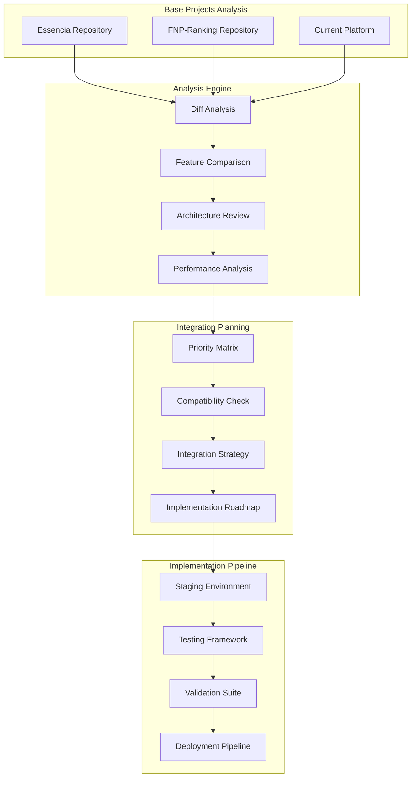
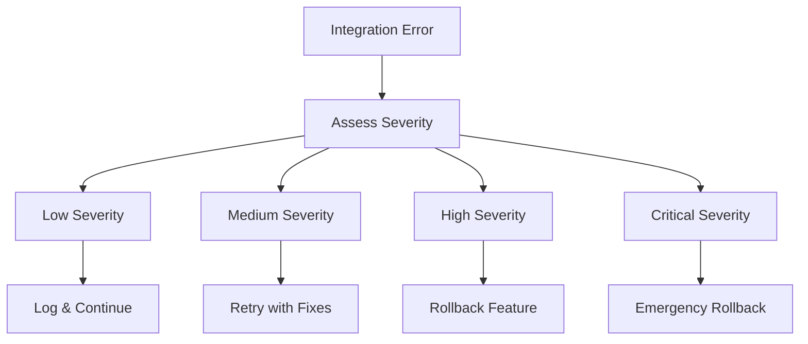
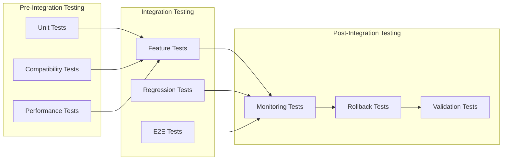

# Design Document

## Overview

This design document outlines the systematic approach for analyzing the updated Essencia and FNP-Ranking base projects, identifying valuable improvements, and integrating them into our unified white-label gamification platform. The design ensures that we can benefit from the latest enhancements in the source projects while preserving our platform's unique white-label capabilities and architectural improvements.

## Architecture

### Analysis and Integration Pipeline



### Technology Stack for Analysis

**Analysis Tools**:
- **Git Diff Analysis**: Custom scripts to compare repository changes
- **AST Parsing**: TypeScript compiler API for code structure analysis
- **Bundle Analysis**: Webpack Bundle Analyzer for performance impact
- **Dependency Analysis**: npm-check-updates and audit tools

**Integration Framework**:
- **Feature Flags**: Enhanced feature toggle system for gradual rollout
- **A/B Testing**: Framework for comparing old vs new implementations
- **Rollback Mechanism**: Git-based rollback with database migration support
- **Monitoring**: Enhanced logging and metrics collection

## Components and Interfaces

### Analysis Components

#### 1. Repository Analyzer

```typescript
interface RepositoryAnalyzer {
  analyzeChanges(baseRepo: string, currentRepo: string): ChangeAnalysis;
  identifyNewFeatures(changes: ChangeAnalysis): Feature[];
  assessArchitecturalChanges(changes: ChangeAnalysis): ArchitecturalChange[];
  evaluatePerformanceImpact(changes: ChangeAnalysis): PerformanceImpact;
}

interface ChangeAnalysis {
  addedFiles: FileChange[];
  modifiedFiles: FileChange[];
  deletedFiles: FileChange[];
  dependencyChanges: DependencyChange[];
  configurationChanges: ConfigChange[];
}

interface FileChange {
  path: string;
  type: 'component' | 'service' | 'utility' | 'config' | 'test';
  changeType: 'added' | 'modified' | 'deleted';
  linesAdded: number;
  linesRemoved: number;
  complexity: 'low' | 'medium' | 'high';
  impact: 'breaking' | 'additive' | 'neutral';
}
```

#### 2. Feature Comparison Engine

```typescript
interface FeatureComparisonEngine {
  compareFeatures(
    essenciaFeatures: Feature[],
    fnpFeatures: Feature[],
    currentFeatures: Feature[]
  ): FeatureComparison;
  identifyGaps(comparison: FeatureComparison): FeatureGap[];
  prioritizeFeatures(gaps: FeatureGap[]): PrioritizedFeature[];
}

interface Feature {
  id: string;
  name: string;
  description: string;
  category: 'dashboard' | 'ranking' | 'auth' | 'admin' | 'integration';
  complexity: 'low' | 'medium' | 'high';
  dependencies: string[];
  whiteLabelCompatible: boolean;
  performanceImpact: 'positive' | 'neutral' | 'negative';
}

interface FeatureGap {
  feature: Feature;
  sourceProject: 'essencia' | 'fnp-ranking';
  integrationComplexity: 'low' | 'medium' | 'high';
  businessValue: 'low' | 'medium' | 'high';
  technicalRisk: 'low' | 'medium' | 'high';
}
```

#### 3. Compatibility Checker

```typescript
interface CompatibilityChecker {
  checkWhiteLabelCompatibility(feature: Feature): CompatibilityResult;
  validateAPICompatibility(changes: APIChange[]): APICompatibilityResult;
  assessDatabaseCompatibility(changes: DatabaseChange[]): DatabaseCompatibilityResult;
  evaluateUICompatibility(changes: UIChange[]): UICompatibilityResult;
}

interface CompatibilityResult {
  isCompatible: boolean;
  issues: CompatibilityIssue[];
  migrationRequired: boolean;
  migrationComplexity: 'low' | 'medium' | 'high';
  recommendations: string[];
}

interface CompatibilityIssue {
  type: 'breaking' | 'warning' | 'info';
  component: string;
  description: string;
  solution: string;
  effort: 'low' | 'medium' | 'high';
}
```

### Integration Components

#### 1. Integration Strategy Manager

```typescript
interface IntegrationStrategyManager {
  createIntegrationPlan(features: PrioritizedFeature[]): IntegrationPlan;
  generateMigrationSteps(plan: IntegrationPlan): MigrationStep[];
  createRollbackStrategy(plan: IntegrationPlan): RollbackStrategy;
  estimateImplementationEffort(plan: IntegrationPlan): EffortEstimate;
}

interface IntegrationPlan {
  phases: IntegrationPhase[];
  dependencies: PhaseDependency[];
  riskMitigation: RiskMitigationStrategy[];
  testingStrategy: TestingStrategy;
  rollbackPlan: RollbackStrategy;
}

interface IntegrationPhase {
  id: string;
  name: string;
  features: Feature[];
  estimatedEffort: number; // hours
  prerequisites: string[];
  deliverables: string[];
  successCriteria: string[];
}
```

#### 2. Feature Integration Service

```typescript
interface FeatureIntegrationService {
  integrateFeature(feature: Feature, strategy: IntegrationStrategy): IntegrationResult;
  validateIntegration(feature: Feature): ValidationResult;
  rollbackFeature(feature: Feature): RollbackResult;
  monitorFeaturePerformance(feature: Feature): PerformanceMetrics;
}

interface IntegrationStrategy {
  approach: 'direct' | 'gradual' | 'parallel';
  featureFlags: FeatureFlagConfig[];
  testingApproach: 'unit' | 'integration' | 'e2e' | 'all';
  rolloutStrategy: 'immediate' | 'gradual' | 'canary';
}

interface IntegrationResult {
  success: boolean;
  feature: Feature;
  changes: CodeChange[];
  tests: TestResult[];
  performance: PerformanceImpact;
  issues: IntegrationIssue[];
}
```

## Data Models

### Analysis Data Models

```typescript
// Project Analysis Model
interface ProjectAnalysis {
  id: string;
  projectName: 'essencia' | 'fnp-ranking';
  analysisDate: Date;
  repositoryUrl: string;
  commitHash: string;
  features: Feature[];
  architecturalChanges: ArchitecturalChange[];
  performanceMetrics: PerformanceMetrics;
  securityImprovements: SecurityImprovement[];
  dependencies: DependencyAnalysis;
}

// Feature Analysis Model
interface FeatureAnalysis {
  feature: Feature;
  sourceCode: SourceCodeAnalysis;
  dependencies: string[];
  testCoverage: TestCoverageAnalysis;
  performanceProfile: PerformanceProfile;
  securityAssessment: SecurityAssessment;
  whiteLabelImpact: WhiteLabelImpact;
}

// Integration Tracking Model
interface IntegrationTracking {
  id: string;
  feature: Feature;
  status: 'planned' | 'in-progress' | 'testing' | 'completed' | 'rolled-back';
  startDate: Date;
  completionDate?: Date;
  assignedDeveloper: string;
  testResults: TestResult[];
  performanceImpact: PerformanceImpact;
  issues: IntegrationIssue[];
  rollbackPlan: RollbackStrategy;
}
```

### Configuration Models

```typescript
// Analysis Configuration
interface AnalysisConfiguration {
  repositories: {
    essencia: RepositoryConfig;
    fnpRanking: RepositoryConfig;
    current: RepositoryConfig;
  };
  analysisRules: AnalysisRule[];
  prioritizationCriteria: PrioritizationCriteria;
  compatibilityRules: CompatibilityRule[];
}

interface RepositoryConfig {
  url: string;
  branch: string;
  accessToken?: string;
  localPath?: string;
}

// Integration Configuration
interface IntegrationConfiguration {
  featureFlags: FeatureFlagConfig[];
  testingConfiguration: TestingConfig;
  deploymentConfiguration: DeploymentConfig;
  monitoringConfiguration: MonitoringConfig;
  rollbackConfiguration: RollbackConfig;
}
```

## Error Handling

### Analysis Error Handling

```typescript
enum AnalysisErrorType {
  REPOSITORY_ACCESS_ERROR = "REPOSITORY_ACCESS_ERROR",
  PARSING_ERROR = "PARSING_ERROR",
  COMPARISON_ERROR = "COMPARISON_ERROR",
  COMPATIBILITY_ERROR = "COMPATIBILITY_ERROR",
  PERFORMANCE_ANALYSIS_ERROR = "PERFORMANCE_ANALYSIS_ERROR"
}

interface AnalysisError {
  type: AnalysisErrorType;
  message: string;
  component: string;
  details?: any;
  recoverable: boolean;
  suggestions: string[];
}
```

### Integration Error Handling

```typescript
enum IntegrationErrorType {
  FEATURE_CONFLICT = "FEATURE_CONFLICT",
  DEPENDENCY_ERROR = "DEPENDENCY_ERROR",
  TEST_FAILURE = "TEST_FAILURE",
  PERFORMANCE_REGRESSION = "PERFORMANCE_REGRESSION",
  COMPATIBILITY_ISSUE = "COMPATIBILITY_ISSUE"
}

interface IntegrationError {
  type: IntegrationErrorType;
  feature: Feature;
  message: string;
  severity: 'low' | 'medium' | 'high' | 'critical';
  rollbackRequired: boolean;
  resolution: string;
}
```

### Error Recovery Strategies



## Testing Strategy

### Analysis Testing

```typescript
interface AnalysisTestSuite {
  repositoryAccessTests: RepositoryTest[];
  parsingTests: ParsingTest[];
  comparisonTests: ComparisonTest[];
  compatibilityTests: CompatibilityTest[];
  performanceTests: PerformanceTest[];
}

interface RepositoryTest {
  name: string;
  repository: string;
  expectedFiles: string[];
  expectedStructure: ProjectStructure;
  testFunction: () => Promise<TestResult>;
}
```

### Integration Testing

```typescript
interface IntegrationTestSuite {
  featureTests: FeatureTest[];
  compatibilityTests: CompatibilityTest[];
  performanceTests: PerformanceTest[];
  regressionTests: RegressionTest[];
  e2eTests: E2ETest[];
}

interface FeatureTest {
  feature: Feature;
  testCases: TestCase[];
  expectedBehavior: ExpectedBehavior;
  rollbackTest: RollbackTest;
}
```

### Testing Pipeline



## Security Considerations

### Analysis Security

1. **Repository Access Security**
   - Secure token management for repository access
   - Read-only access to prevent accidental modifications
   - Audit logging of all repository operations

2. **Code Analysis Security**
   - Sandboxed execution environment for code analysis
   - Input validation for all analyzed code
   - Protection against malicious code injection

### Integration Security

1. **Feature Integration Security**
   - Security review for all integrated features
   - Vulnerability scanning of new dependencies
   - Authentication and authorization validation

2. **Data Protection**
   - Encryption of sensitive configuration data
   - Secure storage of integration credentials
   - Protection of user data during migrations

### Security Validation Framework

```typescript
interface SecurityValidator {
  validateFeatureSecurity(feature: Feature): SecurityValidationResult;
  scanDependencies(dependencies: Dependency[]): DependencySecurityResult;
  auditIntegrationChanges(changes: CodeChange[]): SecurityAuditResult;
  validateDataMigration(migration: DataMigration): DataSecurityResult;
}

interface SecurityValidationResult {
  passed: boolean;
  vulnerabilities: SecurityVulnerability[];
  recommendations: SecurityRecommendation[];
  riskLevel: 'low' | 'medium' | 'high' | 'critical';
}
```

## Performance Optimization

### Analysis Performance

1. **Parallel Processing**
   - Concurrent analysis of multiple repositories
   - Parallel feature comparison and evaluation
   - Distributed processing for large codebases

2. **Caching Strategy**
   - Cache analysis results for repeated operations
   - Incremental analysis for repository updates
   - Persistent storage of analysis metadata

### Integration Performance

1. **Gradual Rollout**
   - Feature flags for controlled feature activation
   - Canary deployments for performance validation
   - Real-time performance monitoring

2. **Performance Monitoring**
   - Continuous performance metrics collection
   - Automated performance regression detection
   - Performance impact assessment for each feature

### Performance Metrics Framework

```typescript
interface PerformanceMonitor {
  measureAnalysisPerformance(operation: AnalysisOperation): PerformanceMetrics;
  trackIntegrationPerformance(integration: Integration): PerformanceImpact;
  generatePerformanceReport(timeframe: TimeRange): PerformanceReport;
  alertOnPerformanceRegression(threshold: PerformanceThreshold): void;
}

interface PerformanceMetrics {
  executionTime: number;
  memoryUsage: number;
  cpuUsage: number;
  networkRequests: number;
  cacheHitRate: number;
}
```

## Implementation Phases

### Phase 1: Analysis Infrastructure (Week 1-2)

1. **Repository Analysis Tools**
   - Git diff analysis implementation
   - AST parsing for code structure analysis
   - Dependency analysis tools
   - Performance profiling setup

2. **Comparison Engine**
   - Feature identification algorithms
   - Architectural change detection
   - Compatibility assessment framework
   - Priority scoring system

### Phase 2: Integration Framework (Week 3-4)

1. **Integration Planning Tools**
   - Integration strategy generator
   - Migration step planner
   - Risk assessment framework
   - Effort estimation tools

2. **Integration Execution**
   - Feature integration service
   - Testing automation
   - Rollback mechanisms
   - Performance monitoring

### Phase 3: Validation and Monitoring (Week 5-6)

1. **Comprehensive Testing**
   - Automated test suite execution
   - Performance regression testing
   - Security validation
   - Compatibility verification

2. **Monitoring and Reporting**
   - Real-time integration monitoring
   - Performance impact tracking
   - Success metrics collection
   - Reporting dashboard

This design provides a comprehensive framework for analyzing the updated base projects and systematically integrating valuable improvements into our unified white-label gamification platform while maintaining stability, security, and performance.