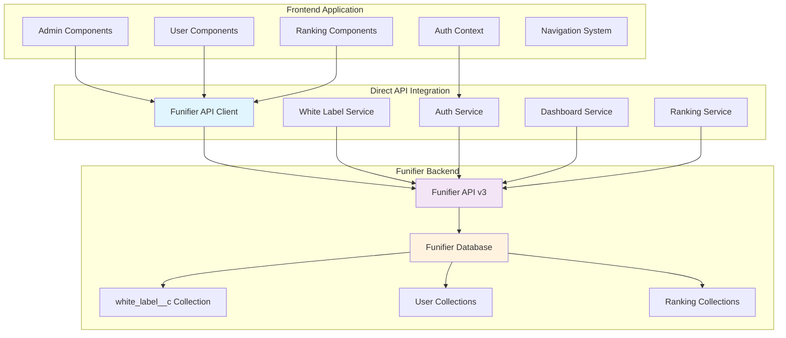

# Design Document

## Overview

This design addresses the migration from internal API routes to direct Funifier API integration, fixing authentication and navigation issues, and ensuring proper data persistence. The system will be transformed into a true headless application that communicates directly with Funifier APIs from the frontend, eliminating the problematic internal API layer that's causing data persistence issues.

## Architecture



## Components and Interfaces

### 1. Enhanced Funifier API Client

The existing `FunifierApiClient` will be extended to support all required operations:

```typescript
interface EnhancedFunifierApiClient {
  // Authentication
  authenticate(username: string, password: string): Promise<AuthResponse>;
  verifyToken(token: string): Promise<TokenValidation>;
  refreshToken(refreshToken: string): Promise<AuthResponse>;
  
  // User Data
  getUserProfile(userId: string): Promise<UserProfile>;
  getUserDashboard(userId: string): Promise<DashboardData>;
  getUserRanking(userId: string): Promise<RankingData>;
  getUserHistory(userId: string, season?: string): Promise<HistoryData>;
  
  // White Label Configuration
  getWhiteLabelConfig(instanceId: string): Promise<WhiteLabelConfig>;
  saveWhiteLabelConfig(instanceId: string, config: WhiteLabelConfig): Promise<void>;
  
  // Ranking System
  getGlobalRanking(filters?: RankingFilters): Promise<GlobalRanking>;
  getPersonalizedRanking(userId: string): Promise<PersonalizedRanking>;
  
  // Admin Operations
  verifyAdminRole(userId: string): Promise<AdminVerification>;
  executeQuickAction(action: QuickAction): Promise<ActionResult>;
}
```

### 2. Frontend Service Layer

Direct API integration services that replace internal API routes:

```typescript
// services/funifier-direct.service.ts
export class FunifierDirectService {
  private apiClient: FunifierApiClient;
  
  constructor() {
    this.apiClient = new FunifierApiClient(process.env.NEXT_PUBLIC_FUNIFIER_URL);
  }
  
  // Direct authentication with Funifier
  async authenticateUser(credentials: LoginCredentials): Promise<AuthResult> {
    const response = await this.apiClient.authenticate(
      credentials.username, 
      credentials.password
    );
    
    // Store token in secure storage
    this.storeAuthToken(response.access_token, response.expires_in);
    
    return {
      success: true,
      user: response.user,
      token: response.access_token,
      expiresIn: response.expires_in
    };
  }
  
  // Direct white label configuration access
  async getWhiteLabelConfig(): Promise<WhiteLabelConfig> {
    const instanceId = this.getInstanceId();
    return await this.apiClient.get(`/database/white_label__c/${instanceId}`);
  }
  
  async saveWhiteLabelConfig(config: WhiteLabelConfig): Promise<void> {
    const instanceId = this.getInstanceId();
    await this.apiClient.post(`/database/white_label__c/${instanceId}`, config);
  }
}
```

### 3. Authentication Context Enhancement

```typescript
// contexts/auth.context.tsx
interface AuthContextType {
  user: User | null;
  isAuthenticated: boolean;
  isAdmin: boolean;
  login: (credentials: LoginCredentials) => Promise<void>;
  logout: () => void;
  verifyAdminAccess: () => Promise<boolean>;
  refreshToken: () => Promise<void>;
}

export const AuthProvider: React.FC<{ children: ReactNode }> = ({ children }) => {
  const [user, setUser] = useState<User | null>(null);
  const [isAuthenticated, setIsAuthenticated] = useState(false);
  const [isAdmin, setIsAdmin] = useState(false);
  
  const login = async (credentials: LoginCredentials) => {
    const result = await funifierDirectService.authenticateUser(credentials);
    
    if (result.success) {
      setUser(result.user);
      setIsAuthenticated(true);
      
      // Verify admin role directly with Funifier
      const adminVerification = await funifierDirectService.verifyAdminRole(result.user.id);
      setIsAdmin(adminVerification.isAdmin);
    }
  };
  
  // ... rest of implementation
};
```

### 4. Navigation System Redesign

```typescript
// components/navigation/SystemNavigation.tsx
export const SystemNavigation: React.FC = () => {
  const { isAuthenticated, isAdmin } = useAuth();
  const router = useRouter();
  
  const navigateToUserDashboard = () => {
    // Direct navigation without authentication barriers
    router.push('/dashboard');
  };
  
  const navigateToRanking = () => {
    router.push('/ranking');
  };
  
  const navigateToAdmin = () => {
    if (isAdmin) {
      router.push('/admin');
    }
  };
  
  return (
    <nav className="system-navigation">
      {isAuthenticated && (
        <>
          <NavButton onClick={navigateToUserDashboard}>
            User Dashboard
          </NavButton>
          <NavButton onClick={navigateToRanking}>
            Ranking
          </NavButton>
          {isAdmin && (
            <NavButton onClick={navigateToAdmin}>
              Admin Panel
            </NavButton>
          )}
        </>
      )}
    </nav>
  );
};
```

## Data Models

### Funifier API Response Models

```typescript
// types/funifier-responses.ts
interface AuthResponse {
  access_token: string;
  token_type: 'Bearer';
  expires_in: number;
  refresh_token?: string;
  user: {
    id: string;
    username: string;
    email: string;
    roles: string[];
  };
}

interface DashboardData {
  user: UserProfile;
  goals: Goal[];
  points: PointsData;
  boosts: Boost[];
  achievements: Achievement[];
  currentSeason: SeasonData;
}

interface RankingData {
  globalRanking: RankingEntry[];
  personalizedRanking: {
    userPosition: number;
    contextualRanking: RankingEntry[];
    topThree: RankingEntry[];
  };
  filters: RankingFilters;
}

interface WhiteLabelConfig {
  _id: string;
  instanceId: string;
  branding: {
    logo: string;
    colors: ColorScheme;
    fonts: FontConfiguration;
  };
  features: {
    ranking: boolean;
    dashboardTypes: string[];
    customFeatures: Record<string, boolean>;
  };
  settings: {
    demoMode: boolean;
    defaultLanguage: string;
    timezone: string;
  };
}
```

### API Endpoint Mapping

```typescript
// config/funifier-endpoints.ts
export const FUNIFIER_ENDPOINTS = {
  // Authentication
  AUTH_TOKEN: '/auth/token',
  AUTH_VERIFY: '/auth/verify',
  AUTH_REFRESH: '/auth/refresh',
  
  // User Data
  USER_PROFILE: '/users/{userId}',
  USER_DASHBOARD: '/reports/dashboard/{userId}',
  USER_RANKING: '/reports/ranking/{userId}',
  USER_HISTORY: '/reports/history/{userId}',
  
  // Database Collections
  WHITE_LABEL_COLLECTION: '/database/white_label__c',
  USER_COLLECTION: '/database/users__c',
  RANKING_COLLECTION: '/database/ranking__c',
  
  // Admin Operations
  ADMIN_VERIFY: '/database/principal',
  ADMIN_ACTIONS: '/admin/actions',
  
  // System
  HEALTH_CHECK: '/health',
  VERSION: '/version'
} as const;
```

## Error Handling

### Enhanced Error Management

```typescript
// services/error-handler.service.ts
export class ErrorHandlerService {
  static handleFunifierError(error: ApiError): UserFriendlyError {
    switch (error.type) {
      case ErrorType.AUTHENTICATION_ERROR:
        return {
          message: 'Authentication failed. Please check your credentials.',
          action: 'REDIRECT_TO_LOGIN',
          retryable: false
        };
        
      case ErrorType.FUNIFIER_API_ERROR:
        if (error.details?.status === 404) {
          return {
            message: 'Data not found. This might be a new user or missing configuration.',
            action: 'SHOW_SETUP_GUIDE',
            retryable: false
          };
        }
        return {
          message: 'Service temporarily unavailable. Please try again.',
          action: 'RETRY_WITH_BACKOFF',
          retryable: true
        };
        
      case ErrorType.NETWORK_ERROR:
        return {
          message: 'Connection failed. Please check your internet connection.',
          action: 'RETRY_WITH_BACKOFF',
          retryable: true
        };
        
      default:
        return {
          message: 'An unexpected error occurred. Please try again.',
          action: 'RETRY_ONCE',
          retryable: true
        };
    }
  }
}
```

### Fallback Mechanisms

```typescript
// services/fallback.service.ts
export class FallbackService {
  private static readonly CACHE_DURATION = 5 * 60 * 1000; // 5 minutes
  private cache = new Map<string, { data: any; timestamp: number }>();
  
  async getWithFallback<T>(
    key: string,
    fetcher: () => Promise<T>,
    fallbackData?: T
  ): Promise<T> {
    try {
      const data = await fetcher();
      this.cache.set(key, { data, timestamp: Date.now() });
      return data;
    } catch (error) {
      // Try cache first
      const cached = this.cache.get(key);
      if (cached && (Date.now() - cached.timestamp) < this.CACHE_DURATION) {
        console.warn(`Using cached data for ${key} due to API error:`, error);
        return cached.data;
      }
      
      // Use fallback data if available
      if (fallbackData !== undefined) {
        console.warn(`Using fallback data for ${key} due to API error:`, error);
        return fallbackData;
      }
      
      throw error;
    }
  }
}
```

## Testing Strategy

### Integration Testing

```typescript
// __tests__/integration/funifier-direct-integration.test.ts
describe('Funifier Direct Integration', () => {
  let funifierService: FunifierDirectService;
  
  beforeEach(() => {
    funifierService = new FunifierDirectService();
  });
  
  describe('Authentication Flow', () => {
    it('should authenticate user directly with Funifier', async () => {
      const credentials = { username: 'testuser', password: 'testpass' };
      const result = await funifierService.authenticateUser(credentials);
      
      expect(result.success).toBe(true);
      expect(result.token).toBeDefined();
      expect(result.user).toBeDefined();
    });
    
    it('should verify admin role through Funifier API', async () => {
      const userId = 'test-admin-id';
      const verification = await funifierService.verifyAdminRole(userId);
      
      expect(verification.isAdmin).toBeDefined();
    });
  });
  
  describe('Data Persistence', () => {
    it('should save white label config to Funifier database', async () => {
      const config: WhiteLabelConfig = {
        instanceId: 'test-instance',
        branding: { /* test data */ },
        features: { /* test data */ },
        settings: { /* test data */ }
      };
      
      await expect(funifierService.saveWhiteLabelConfig(config)).resolves.not.toThrow();
      
      // Verify data was saved
      const savedConfig = await funifierService.getWhiteLabelConfig();
      expect(savedConfig.instanceId).toBe(config.instanceId);
    });
  });
  
  describe('Navigation and Access', () => {
    it('should allow admin access to all system areas', async () => {
      // Test navigation without authentication barriers
      const dashboardData = await funifierService.getUserDashboard('admin-user-id');
      const rankingData = await funifierService.getGlobalRanking();
      
      expect(dashboardData).toBeDefined();
      expect(rankingData).toBeDefined();
    });
  });
});
```

### Mock Data Removal Testing

```typescript
// __tests__/mock-data-removal.test.ts
describe('Mock Data Removal', () => {
  it('should not use mock data in production mode', async () => {
    process.env.DEMO_MODE_ENABLED = 'false';
    
    const dashboardService = new DashboardService();
    const data = await dashboardService.getDashboardData('user-id');
    
    // Verify all data comes from Funifier APIs
    expect(data.source).toBe('funifier');
    expect(data.isMockData).toBe(false);
  });
  
  it('should use mock data only in demo mode', async () => {
    process.env.DEMO_MODE_ENABLED = 'true';
    
    const dashboardService = new DashboardService();
    const data = await dashboardService.getDashboardData('demo-user');
    
    expect(data.source).toBe('demo');
    expect(data.isMockData).toBe(true);
  });
});
```

## Implementation Phases

### Phase 1: Direct API Integration Setup
- Enhance FunifierApiClient with all required methods
- Create direct service layer (FunifierDirectService)
- Implement authentication context with direct Funifier integration
- Set up proper error handling and fallback mechanisms

### Phase 2: Authentication and Navigation Fix
- Fix authentication flow to use direct Funifier APIs
- Implement proper session management
- Create seamless navigation between admin and user interfaces
- Remove authentication barriers for authenticated users

### Phase 3: Data Migration and Persistence
- Replace all internal API calls with direct Funifier API calls
- Implement white label configuration storage in white_label__c collection
- Ensure all user data operations persist to Funifier
- Implement proper caching strategies

### Phase 4: Quick Actions and Admin Features
- Implement functional quick action buttons
- Connect admin operations to Funifier APIs
- Ensure all admin configurations persist properly
- Add real-time feedback for admin operations

### Phase 5: Mock Data Cleanup and Testing
- Remove all mock data outside of demo mode
- Implement comprehensive testing for all integrations
- Verify data persistence across all operations
- Ensure proper fallback behavior

This design provides a comprehensive solution for migrating to direct Funifier API integration while fixing authentication, navigation, and data persistence issues. The headless architecture is maintained while ensuring all operations work directly with the Funifier backend.