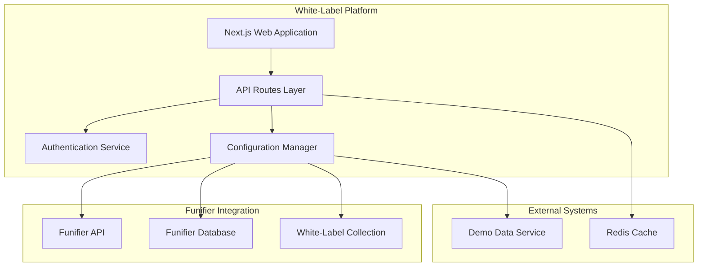
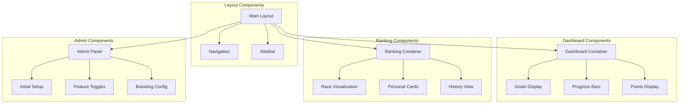
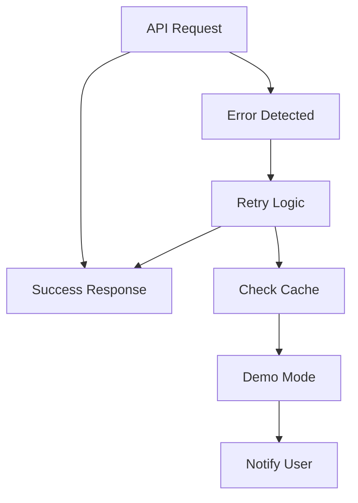
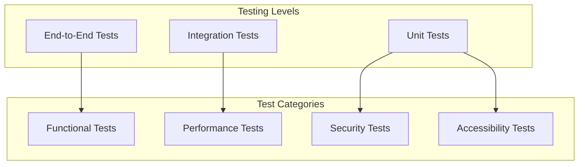
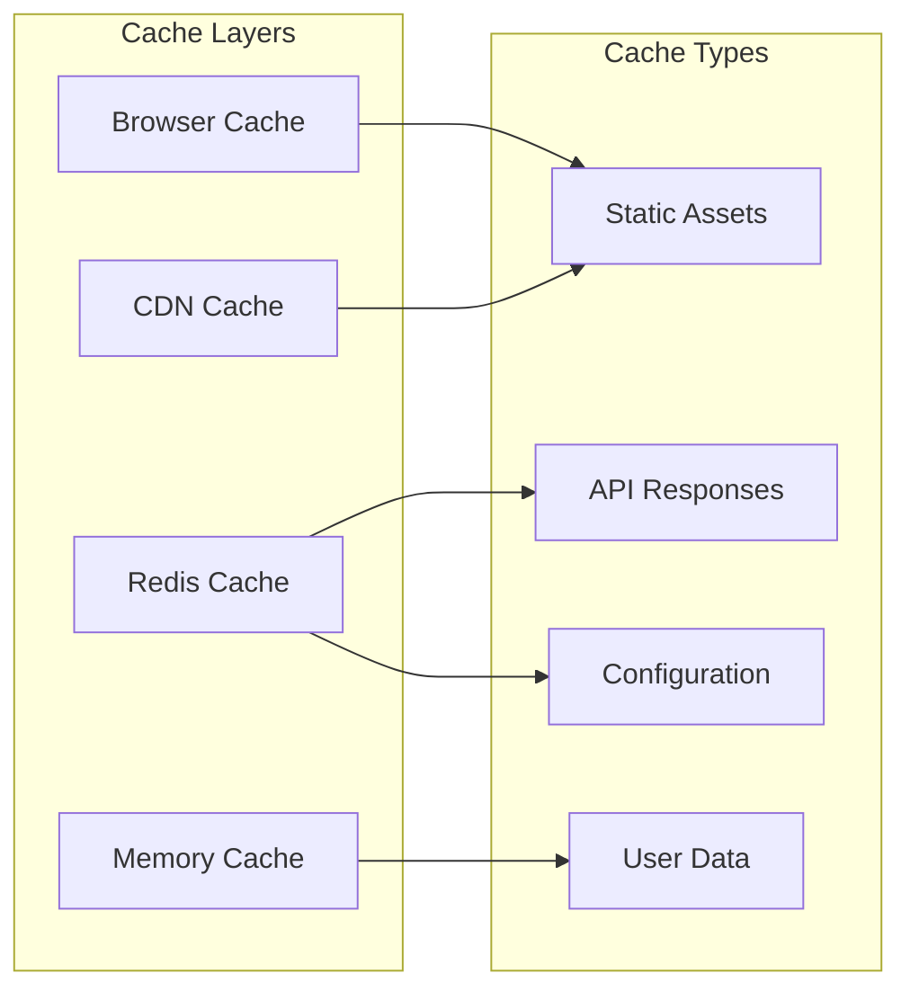
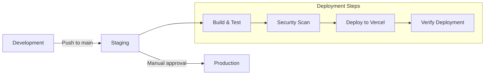

# Design Document

## Overview

The white-label gamification platform is a unified Next.js application that combines the individual dashboard functionality from Essencia with the ranking system from fnp. The platform maintains a headless architecture while providing both end-user interfaces and administrative white-label configuration capabilities. The system uses Funifier as the primary data source and configuration store, enabling each white-label instance to maintain its own branding and feature set.

## Architecture

### High-Level Architecture



### Technology Stack

**Frontend Framework**: Next.js 14 with React 18

- **Styling**: Tailwind CSS for consistent design system
- **State Management**: React Query for server state, Zustand for client state
- **Animations**: Framer Motion for smooth transitions and loading states
- **Icons**: Lucide React and Heroicons for consistent iconography

**Backend Services**: Next.js API Routes

- **Authentication**: Custom Funifier-based auth with role verification
- **Data Fetching**: Axios with retry logic and error handling
- **Caching**: Redis for performance optimization
- **Validation**: Zod for runtime type checking

**Infrastructure**:

- **Version Control**: Git for source code management and collaboration
- **Deployment**: Vercel for seamless deployment and scaling
- **Environment Management**: Environment-based configuration
- **Monitoring**: Built-in error tracking and performance monitoring

## Components and Interfaces

### Core Components Architecture



### API Interface Design

#### Authentication Endpoints

```typescript
// POST /api/auth/login - Uses Funifier auth endpoint
interface LoginRequest {
  username: string;
  password: string;
}

interface LoginResponse {
  access_token: string;
  token_type: string;
  expires_in: number;
  refresh_token?: string;
  user: FunifierPlayerStatus;
}

// GET /api/auth/verify-admin - Uses /v3/database/principal
interface AdminVerificationResponse {
  isAdmin: boolean;
  roles: string[];
  playerData: FunifierPlayerStatus;
}
```

#### Configuration Endpoints

```typescript
// GET /api/config/white-label - Fetches from Funifier database collection whitelabel__c
interface WhiteLabelConfig {
  _id: string;
  instanceId: string;
  branding: {
    primaryColor: string;
    secondaryColor: string;
    logo: string;
    companyName: string;
  };
  features: {
    ranking: boolean;
    dashboards: {
      carteira_i: boolean;
      carteira_ii: boolean;
      carteira_iii: boolean;
      carteira_iv: boolean;
    };
  };
  funifierConfig: {
    isConfigured: boolean;
    serverUrl?: string;
  };
}

// POST /api/config/setup - Creates/updates whitelabel__c collection
interface SetupRequest {
  mode: "demo" | "funifier";
  funifierCredentials?: {
    apiKey: string;
    serverUrl: string;
    authToken: string;
  };
}
```

#### Dashboard Endpoints

```typescript
// GET /api/dashboard/player/{playerId} - Uses /v3/player/{id}/status
interface DashboardResponse {
  playerName: string;
  totalPoints: number;
  pointsLocked: boolean;
  currentCycleDay: number;
  totalCycleDays: number;
  primaryGoal: Goal;
  secondaryGoal1: Goal;
  secondaryGoal2: Goal;
}

// GET /api/dashboard/history/{playerId} - Uses /v3/database/{collection}/aggregate
interface HistoryResponse {
  seasons: Season[];
  currentSeasonGraphs: PerformanceGraph[];
}
```

#### Ranking Endpoints

```typescript
// GET /api/ranking/leaderboards - Uses /v3/leaderboard
interface LeaderboardsResponse {
  leaderboards: Leaderboard[];
}

// GET /api/ranking/{leaderboardId}/personal/{playerId} - Uses /v3/leaderboard/{id}/leader/aggregate
interface PersonalRankingResponse {
  raceData: RaceVisualization;
  personalCard: PersonalCard;
  topThree: Player[];
  contextualRanking: {
    above: Player | null;
    current: Player;
    below: Player | null;
  };
}

// GET /api/ranking/{leaderboardId}/global - Uses /v3/leaderboard/{id}/leader/aggregate
interface GlobalRankingResponse {
  raceData: RaceVisualization;
  fullRanking: Player[];
}
```

## Data Models

### Core Data Models

```typescript
// White-Label Configuration Model (stored in Funifier collection whitelabel__c)
interface WhiteLabelConfiguration {
  _id: string;
  instanceId: string;
  branding: {
    primaryColor: string;
    secondaryColor: string;
    accentColor: string;
    logo: string;
    favicon: string;
    companyName: string;
    tagline: string;
  };
  features: {
    ranking: boolean;
    dashboards: Record<string, boolean>;
    history: boolean;
    personalizedRanking: boolean;
  };
  funifierIntegration: {
    apiKey: string; // Encrypted
    serverUrl: string;
    authToken: string; // Encrypted
    customCollections: string[];
  };
  createdAt: number; // Funifier timestamp
  updatedAt: number; // Funifier timestamp
}

// User Model (based on Funifier Player Status)
interface FunifierPlayerStatus {
  _id: string;
  name: string;
  image?: {
    small: ImageInfo;
    medium: ImageInfo;
    original: ImageInfo;
  };
  total_challenges: number;
  challenges: Record<string, number>;
  total_points: number;
  point_categories: Record<string, number>;
  total_catalog_items: number;
  catalog_items: Record<string, number>;
  level_progress: {
    percent_completed: number;
    next_points: number;
    total_levels: number;
    percent: number;
  };
  challenge_progress: any[];
  teams: string[];
  positions: any[];
  time: number;
  extra: Record<string, any>;
  pointCategories: Record<string, number>;
}

interface ImageInfo {
  url: string;
  size: number;
  width: number;
  height: number;
  depth: number;
}

// Dashboard Goal Model
interface Goal {
  name: string;
  percentage: number;
  description: string;
  emoji: string;
  target?: number;
  current?: number;
  unit?: string;
  hasBoost?: boolean;
  isBoostActive?: boolean;
  daysRemaining?: number;
}

// Player Performance Model
interface PlayerPerformance {
  playerId: string;
  playerName: string;
  totalPoints: number;
  position: number;
  previousPosition?: number;
  pointsGainedToday: number;
  avatar?: string;
  team: string;
  goals: Goal[];
  lastUpdated: Date;
}

// Season History Model
interface Season {
  _id: string;
  name: string;
  startDate: Date;
  endDate: Date;
  playerStats: {
    totalPoints: number;
    finalPosition: number;
    achievements: string[];
    goals: Goal[];
  };
}
```

### Database Schema Design

The platform uses Funifier's database API to store white-label configurations in a custom collection:

```typescript
// Funifier Collection: whitelabel__c
interface FunifierWhiteLabelRecord {
  _id: string; // Auto-generated by Funifier
  instanceId: string; // Unique identifier for each white-label instance
  config: WhiteLabelConfiguration; // Direct object storage
  isActive: boolean;
  createdBy: string;
  lastModifiedBy: string;
  time: number; // Funifier timestamp
}

// Funifier Credentials Storage (encrypted in environment/secure storage)
interface FunifierCredentials {
  apiKey: string;
  serverUrl: string;
  authToken: string; // Basic auth token
}
```

### Funifier Credentials Storage Strategy

The Funifier credentials will be stored using a hybrid approach:

1. **Initial Setup**: Credentials provided by admin during first-time setup
2. **Secure Storage**: Encrypted and stored in:
   - Environment variables (for single-tenant deployments)
   - Secure key management service (for multi-tenant SaaS)
   - Local encrypted configuration file (for on-premise)
3. **Runtime Access**: Credentials loaded at application startup and cached securely
4. **Validation**: Credentials validated against Funifier API during setup and periodically
5. **Reset Capability**: Admin can reset/update credentials through white-label admin panel

## Error Handling

### Error Classification System

```typescript
enum ErrorType {
  AUTHENTICATION_ERROR = "AUTHENTICATION_ERROR",
  FUNIFIER_API_ERROR = "FUNIFIER_API_ERROR",
  CONFIGURATION_ERROR = "CONFIGURATION_ERROR",
  VALIDATION_ERROR = "VALIDATION_ERROR",
  NETWORK_ERROR = "NETWORK_ERROR",
  WHITE_LABEL_ERROR = "WHITE_LABEL_ERROR",
}

interface ApiError {
  type: ErrorType;
  message: string;
  details?: any;
  timestamp: Date;
  retryable: boolean;
  userMessage: string;
}
```

### Error Handling Strategy

1. **Network Errors**: Implement exponential backoff retry logic with maximum 3 attempts
2. **Authentication Errors**: Redirect to login with clear messaging
3. **Configuration Errors**: Fallback to demo mode with admin notification
4. **Validation Errors**: Display inline validation messages
5. **Funifier API Errors**: Graceful degradation with cached data when possible

### Fallback Mechanisms



## Testing Strategy

### Testing Pyramid



### Test Implementation Strategy

**Unit Tests (Jest + Testing Library)**:

- Component rendering and behavior
- Service layer functions
- Utility functions and helpers
- Error handling logic
- Data transformation functions

**Integration Tests**:

- API endpoint functionality
- Funifier integration flows
- Authentication workflows
- Configuration management
- Database operations

**End-to-End Tests (Playwright)**:

- Complete user journeys
- White-label setup flow
- Dashboard navigation
- Ranking interactions
- Admin panel functionality
- Cross-browser compatibility

**Performance Tests**:

- API response times
- Page load performance
- Memory usage monitoring
- Concurrent user handling
- Large dataset processing

### Test Data Management

```typescript
// Demo Data Service for Testing
interface DemoDataService {
  generatePlayers(count: number): Player[];
  generateLeaderboards(): Leaderboard[];
  generateSeasonHistory(playerId: string): Season[];
  generateWhiteLabelConfig(): WhiteLabelConfiguration;
}
```

## Security Considerations

### Authentication and Authorization

1. **Funifier-Based Authentication**: Leverage Funifier's existing auth system
2. **Role-Based Access Control**: Admin role verification via Funifier API
3. **JWT Token Management**: Secure token storage and refresh mechanisms
4. **Session Management**: Automatic session expiration and renewal

### Data Protection

1. **Encryption**: All sensitive data encrypted at rest and in transit
2. **API Key Security**: Funifier credentials encrypted in database
3. **Input Validation**: Comprehensive validation on all user inputs
4. **XSS Prevention**: Sanitization of all user-generated content
5. **CSRF Protection**: Built-in Next.js CSRF protection

### White-Label Security

```typescript
// Security middleware for white-label operations
interface SecurityMiddleware {
  validateWhiteLabelAccess(instanceId: string, userId: string): boolean;
  encryptCredentials(credentials: FunifierCredentials): string;
  decryptCredentials(encryptedData: string): FunifierCredentials;
  validateConfigurationChanges(
    config: WhiteLabelConfiguration
  ): ValidationResult;
}
```

## Performance Optimization

### Caching Strategy



### Performance Targets

- **Initial Page Load**: < 2 seconds
- **API Response Time**: < 5 seconds with loading indicators
- **Navigation**: < 500ms between pages
- **Data Refresh**: < 3 seconds for ranking updates
- **Configuration Changes**: < 1 second application

### Optimization Techniques

1. **Code Splitting**: Dynamic imports for feature modules
2. **Image Optimization**: Next.js Image component with WebP/AVIF
3. **Bundle Analysis**: Regular bundle size monitoring
4. **Lazy Loading**: Progressive loading of non-critical components
5. **Prefetching**: Strategic prefetching of likely-needed data

## Deployment Architecture

### Environment Configuration

```typescript
interface EnvironmentConfig {
  NODE_ENV: "development" | "staging" | "production";
  NEXT_PUBLIC_APP_URL: string;
  REDIS_URL?: string;
  ENCRYPTION_KEY: string;
  DEFAULT_FUNIFIER_URL: string;
  DEMO_MODE_ENABLED: boolean;
}
```

### Deployment Pipeline



### Monitoring and Observability

1. **Error Tracking**: Comprehensive error logging and alerting
2. **Performance Monitoring**: Real-time performance metrics
3. **User Analytics**: Usage patterns and feature adoption
4. **Health Checks**: Automated system health monitoring
5. **Funifier Integration Status**: API connectivity monitoring

This design provides a robust foundation for the white-label gamification platform, ensuring scalability, security, and maintainability while delivering the unified experience described in the requirements.
