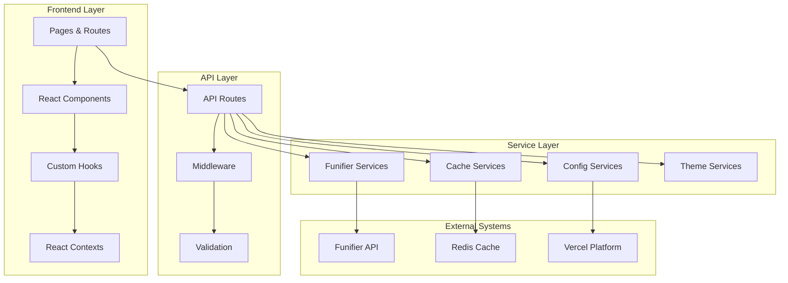

# Developer Documentation - Customization Guide

## Table of Contents

1. [Architecture Overview](#architecture-overview)
2. [Development Environment Setup](#development-environment-setup)
3. [Project Structure](#project-structure)
4. [Customization Framework](#customization-framework)
5. [Component Customization](#component-customization)
6. [Service Layer Extensions](#service-layer-extensions)
7. [API Extensions](#api-extensions)
8. [Theme System](#theme-system)
9. [Feature Development](#feature-development)
10. [Testing Guidelines](#testing-guidelines)
11. [Deployment Customization](#deployment-customization)
12. [Performance Optimization](#performance-optimization)

## Architecture Overview

### Technology Stack

The White-Label Gamification Platform is built with modern web technologies:

```
Frontend:
├── Next.js 14 (React 18)
├── TypeScript
├── Tailwind CSS
├── Framer Motion
└── React Query

Backend:
├── Next.js API Routes
├── Funifier Integration
├── Redis Caching
└── Vercel Deployment

Testing:
├── Jest (Unit Tests)
├── Testing Library (Component Tests)
├── Playwright (E2E Tests)
└── Vitest (Service Tests)
```

### System Architecture



### Design Principles

1. **Modularity**: Components and services are self-contained and reusable
2. **Extensibility**: Easy to add new features without breaking existing functionality
3. **Type Safety**: Full TypeScript coverage for better development experience
4. **Performance**: Optimized for fast loading and smooth user experience
5. **Accessibility**: WCAG 2.1 AA compliant components and interactions

## Development Environment Setup

### Prerequisites

```bash
# Required software
Node.js >= 18.0.0
npm >= 9.0.0
Git >= 2.30.0

# Optional but recommended
Redis (for local caching)
Docker (for containerized development)
```

### Installation

```bash
# Clone the repository
git clone <repository-url>
cd white-label-gamification

# Install dependencies
npm install

# Set up environment variables
cp .env.example .env.local

# Start development server
npm run dev
```

### Environment Configuration

```bash
# .env.local
NODE_ENV=development
NEXT_PUBLIC_APP_URL=http://localhost:3000

# Funifier Configuration (optional for development)
FUNIFIER_API_KEY=your_api_key
FUNIFIER_SERVER_URL=https://service2.funifier.com
FUNIFIER_AUTH_TOKEN=your_auth_token

# Redis Configuration (optional)
REDIS_URL=redis://localhost:6379

# Security
ENCRYPTION_KEY=your_32_character_encryption_key
NEXTAUTH_SECRET=your_nextauth_secret

# Development Features
DEMO_MODE_ENABLED=true
DEBUG_MODE=true
```

### Development Scripts

```bash
# Development
npm run dev          # Start development server
npm run build        # Build for production
npm run start        # Start production server
npm run lint         # Run ESLint
npm run type-check   # TypeScript type checking

# Testing
npm run test         # Run unit tests
npm run test:watch   # Run tests in watch mode
npm run test:e2e     # Run end-to-end tests
npm run test:coverage # Generate coverage report

# Code Quality
npm run format       # Format code with Prettier
npm run analyze      # Analyze bundle size
npm run audit        # Security audit
```

## Project Structure

```
white-label-gamification/
├── src/
│   ├── app/                    # Next.js App Router
│   │   ├── (auth)/            # Auth route group
│   │   ├── admin/             # Admin pages
│   │   ├── api/               # API routes
│   │   ├── dashboard/         # Dashboard pages
│   │   ├── ranking/           # Ranking pages
│   │   └── setup/             # Setup pages
│   ├── components/            # React components
│   │   ├── admin/             # Admin-specific components
│   │   ├── auth/              # Authentication components
│   │   ├── dashboard/         # Dashboard components
│   │   ├── error/             # Error handling components
│   │   ├── feature-gates/     # Feature toggle components
│   │   ├── feedback/          # User feedback components
│   │   ├── history/           # History components
│   │   ├── layout/            # Layout components
│   │   ├── loading/           # Loading state components
│   │   ├── monitoring/        # Monitoring components
│   │   ├── ranking/           # Ranking components
│   │   ├── setup/             # Setup components
│   │   ├── theme/             # Theme components
│   │   └── ui/                # Reusable UI components
│   ├── contexts/              # React contexts
│   ├── hooks/                 # Custom React hooks
│   ├── lib/                   # Utility libraries
│   ├── middleware/            # API middleware
│   ├── services/              # Business logic services
│   ├── types/                 # TypeScript type definitions
│   └── utils/                 # Utility functions
├── docs/                      # Documentation
├── e2e/                       # End-to-end tests
├── public/                    # Static assets
└── __tests__/                 # Test utilities
```

### Key Directories

#### `/src/components`
Reusable React components organized by feature area. Each component includes:
- Main component file
- Test file (`*.test.tsx`)
- Storybook stories (if applicable)
- README for complex components

#### `/src/services`
Business logic and external integrations:
- Funifier API integration
- Caching services
- Configuration management
- Data processing services

#### `/src/hooks`
Custom React hooks for:
- Data fetching and state management
- Authentication and authorization
- Theme and configuration
- Error handling and loading states

#### `/src/types`
TypeScript type definitions:
- Funifier API types
- Component prop types
- Service interfaces
- Configuration schemas

## Customization Framework

### White-Label Configuration System

The platform uses a flexible configuration system stored in Funifier's database:

```typescript
// Configuration Schema
interface WhiteLabelConfiguration {
  instanceId: string;
  branding: BrandingConfig;
  features: FeatureConfig;
  funifierIntegration: FunifierConfig;
  customizations: CustomizationConfig;
}

interface BrandingConfig {
  colors: {
    primary: string;
    secondary: string;
    accent: string;
    background: string;
    text: string;
  };
  typography: {
    fontFamily: string;
    fontSize: {
      base: string;
      heading: string;
    };
  };
  assets: {
    logo: string;
    favicon: string;
    backgroundImage?: string;
  };
  company: {
    name: string;
    tagline?: string;
  };
}
```

### Configuration Service

```typescript
// src/services/white-label-config.service.ts
export class WhiteLabelConfigService {
  async getConfiguration(): Promise<WhiteLabelConfiguration> {
    // Fetch from Funifier database or cache
  }

  async updateConfiguration(
    config: Partial<WhiteLabelConfiguration>
  ): Promise<void> {
    // Update configuration with validation
  }

  async resetToDefaults(): Promise<void> {
    // Reset to neutral defaults
  }
}
```

### Custom Configuration Extensions

To add new configuration options:

1. **Extend the Configuration Interface**:
```typescript
// src/types/custom-config.ts
interface CustomWhiteLabelConfig extends WhiteLabelConfiguration {
  customFeatures: {
    advancedAnalytics: boolean;
    customDashboardLayouts: string[];
    integrationSettings: Record<string, any>;
  };
}
```

2. **Update the Configuration Service**:
```typescript
// src/services/custom-config.service.ts
export class CustomConfigService extends WhiteLabelConfigService {
  async updateCustomFeatures(features: CustomFeatures): Promise<void> {
    const config = await this.getConfiguration();
    config.customFeatures = { ...config.customFeatures, ...features };
    await this.updateConfiguration(config);
  }
}
```

3. **Create Admin UI Components**:
```typescript
// src/components/admin/CustomFeaturesPanel.tsx
export const CustomFeaturesPanel: React.FC = () => {
  const { config, updateConfig } = useCustomConfig();
  
  return (
    <div className="space-y-4">
      <h3>Custom Features</h3>
      {/* Custom feature toggles and settings */}
    </div>
  );
};
```

## Component Customization

### Component Architecture

All components follow a consistent pattern:

```typescript
// Component Props Interface
interface ComponentProps {
  className?: string;
  variant?: 'default' | 'primary' | 'secondary';
  size?: 'sm' | 'md' | 'lg';
  children?: React.ReactNode;
}

// Component Implementation
export const CustomComponent: React.FC<ComponentProps> = ({
  className,
  variant = 'default',
  size = 'md',
  children,
  ...props
}) => {
  const theme = useTheme();
  const classes = cn(
    'base-classes',
    variantClasses[variant],
    sizeClasses[size],
    className
  );

  return (
    <div className={classes} {...props}>
      {children}
    </div>
  );
};
```

### Creating Custom Components

1. **Create Component File**:
```typescript
// src/components/custom/MyCustomComponent.tsx
import { cn } from '@/lib/utils';
import { useTheme } from '@/hooks/useTheme';

interface MyCustomComponentProps {
  title: string;
  data: any[];
  onAction?: (item: any) => void;
  className?: string;
}

export const MyCustomComponent: React.FC<MyCustomComponentProps> = ({
  title,
  data,
  onAction,
  className
}) => {
  const { colors } = useTheme();
  
  return (
    <div 
      className={cn('p-4 rounded-lg border', className)}
      style={{ borderColor: colors.primary }}
    >
      <h3 className="text-lg font-semibold mb-4">{title}</h3>
      <div className="space-y-2">
        {data.map((item, index) => (
          <div 
            key={index}
            className="p-2 hover:bg-gray-50 cursor-pointer"
            onClick={() => onAction?.(item)}
          >
            {/* Custom item rendering */}
          </div>
        ))}
      </div>
    </div>
  );
};
```

2. **Add Component Tests**:
```typescript
// src/components/custom/__tests__/MyCustomComponent.test.tsx
import { render, screen, fireEvent } from '@testing-library/react';
import { MyCustomComponent } from '../MyCustomComponent';

describe('MyCustomComponent', () => {
  const mockData = [
    { id: 1, name: 'Item 1' },
    { id: 2, name: 'Item 2' }
  ];

  it('renders title and data', () => {
    render(
      <MyCustomComponent 
        title="Test Title" 
        data={mockData} 
      />
    );
    
    expect(screen.getByText('Test Title')).toBeInTheDocument();
    expect(screen.getByText('Item 1')).toBeInTheDocument();
  });

  it('calls onAction when item is clicked', () => {
    const mockAction = jest.fn();
    render(
      <MyCustomComponent 
        title="Test" 
        data={mockData} 
        onAction={mockAction}
      />
    );
    
    fireEvent.click(screen.getByText('Item 1'));
    expect(mockAction).toHaveBeenCalledWith(mockData[0]);
  });
});
```

3. **Export from Index**:
```typescript
// src/components/custom/index.ts
export { MyCustomComponent } from './MyCustomComponent';
export type { MyCustomComponentProps } from './MyCustomComponent';
```

### Overriding Existing Components

To customize existing components without modifying core files:

1. **Create Override Component**:
```typescript
// src/components/overrides/CustomDashboardCard.tsx
import { DashboardCard, DashboardCardProps } from '@/components/dashboard/DashboardCard';

export const CustomDashboardCard: React.FC<DashboardCardProps> = (props) => {
  // Add custom logic or styling
  return (
    <div className="custom-wrapper">
      <DashboardCard {...props} />
      {/* Additional custom elements */}
    </div>
  );
};
```

2. **Update Component Registry**:
```typescript
// src/lib/component-registry.ts
import { CustomDashboardCard } from '@/components/overrides/CustomDashboardCard';

export const componentOverrides = {
  DashboardCard: CustomDashboardCard,
  // Add other overrides
};
```

3. **Use in Application**:
```typescript
// src/components/dashboard/DashboardContainer.tsx
import { componentOverrides } from '@/lib/component-registry';

const DashboardCard = componentOverrides.DashboardCard || DefaultDashboardCard;
```

## Service Layer Extensions

### Creating Custom Services

1. **Define Service Interface**:
```typescript
// src/services/interfaces/custom-analytics.interface.ts
export interface CustomAnalyticsService {
  trackEvent(event: string, properties: Record<string, any>): Promise<void>;
  getAnalytics(timeRange: string): Promise<AnalyticsData>;
  generateReport(config: ReportConfig): Promise<Report>;
}
```

2. **Implement Service**:
```typescript
// src/services/custom-analytics.service.ts
import { CustomAnalyticsService } from './interfaces/custom-analytics.interface';

export class CustomAnalyticsServiceImpl implements CustomAnalyticsService {
  constructor(
    private funifierService: FunifierApiClient,
    private cacheService: CacheService
  ) {}

  async trackEvent(event: string, properties: Record<string, any>): Promise<void> {
    // Implementation
    await this.funifierService.post('/custom/analytics/events', {
      event,
      properties,
      timestamp: Date.now()
    });
  }

  async getAnalytics(timeRange: string): Promise<AnalyticsData> {
    const cacheKey = `analytics:${timeRange}`;
    const cached = await this.cacheService.get(cacheKey);
    
    if (cached) {
      return cached;
    }

    const data = await this.funifierService.get(`/custom/analytics?range=${timeRange}`);
    await this.cacheService.set(cacheKey, data, 300); // 5 minutes
    
    return data;
  }

  async generateReport(config: ReportConfig): Promise<Report> {
    // Implementation
  }
}
```

3. **Register Service**:
```typescript
// src/lib/service-registry.ts
import { CustomAnalyticsServiceImpl } from '@/services/custom-analytics.service';

export const serviceRegistry = {
  customAnalytics: new CustomAnalyticsServiceImpl(
    funifierApiClient,
    cacheService
  ),
  // Other services
};
```

4. **Create Hook for Service**:
```typescript
// src/hooks/useCustomAnalytics.ts
import { useQuery, useMutation } from '@tanstack/react-query';
import { serviceRegistry } from '@/lib/service-registry';

export const useCustomAnalytics = () => {
  const service = serviceRegistry.customAnalytics;

  const trackEvent = useMutation({
    mutationFn: ({ event, properties }: { event: string; properties: Record<string, any> }) =>
      service.trackEvent(event, properties),
  });

  const getAnalytics = (timeRange: string) =>
    useQuery({
      queryKey: ['analytics', timeRange],
      queryFn: () => service.getAnalytics(timeRange),
      staleTime: 5 * 60 * 1000, // 5 minutes
    });

  return {
    trackEvent,
    getAnalytics,
  };
};
```

### Extending Existing Services

To extend existing services without modifying core files:

```typescript
// src/services/extensions/enhanced-dashboard.service.ts
import { DashboardProcessorService } from '@/services/dashboard-processor.service';

export class EnhancedDashboardService extends DashboardProcessorService {
  async getEnhancedDashboardData(playerId: string): Promise<EnhancedDashboardData> {
    const baseData = await super.getDashboardData(playerId);
    
    // Add custom enhancements
    const customMetrics = await this.calculateCustomMetrics(playerId);
    const predictions = await this.generatePredictions(baseData);
    
    return {
      ...baseData,
      customMetrics,
      predictions,
    };
  }

  private async calculateCustomMetrics(playerId: string): Promise<CustomMetrics> {
    // Custom metric calculations
  }

  private async generatePredictions(data: DashboardData): Promise<Predictions> {
    // Prediction logic
  }
}
```

## API Extensions

### Creating Custom API Routes

1. **Create API Route**:
```typescript
// src/app/api/custom/analytics/route.ts
import { NextRequest, NextResponse } from 'next/server';
import { authMiddleware } from '@/middleware/auth';
import { validateRequest } from '@/middleware/validation';
import { serviceRegistry } from '@/lib/service-registry';

export async function GET(request: NextRequest) {
  try {
    // Apply middleware
    const authResult = await authMiddleware(request);
    if (!authResult.success) {
      return NextResponse.json({ error: 'Unauthorized' }, { status: 401 });
    }

    const { searchParams } = new URL(request.url);
    const timeRange = searchParams.get('timeRange') || '7d';

    const analytics = await serviceRegistry.customAnalytics.getAnalytics(timeRange);

    return NextResponse.json(analytics);
  } catch (error) {
    console.error('Analytics API error:', error);
    return NextResponse.json(
      { error: 'Internal server error' },
      { status: 500 }
    );
  }
}

export async function POST(request: NextRequest) {
  try {
    const authResult = await authMiddleware(request);
    if (!authResult.success) {
      return NextResponse.json({ error: 'Unauthorized' }, { status: 401 });
    }

    const body = await request.json();
    const validation = validateRequest(body, analyticsEventSchema);
    
    if (!validation.success) {
      return NextResponse.json(
        { error: 'Invalid request', details: validation.errors },
        { status: 400 }
      );
    }

    await serviceRegistry.customAnalytics.trackEvent(
      body.event,
      body.properties
    );

    return NextResponse.json({ success: true });
  } catch (error) {
    console.error('Analytics tracking error:', error);
    return NextResponse.json(
      { error: 'Internal server error' },
      { status: 500 }
    );
  }
}
```

2. **Add Request Validation**:
```typescript
// src/lib/validation/analytics.schema.ts
import { z } from 'zod';

export const analyticsEventSchema = z.object({
  event: z.string().min(1).max(100),
  properties: z.record(z.any()).optional(),
});

export type AnalyticsEventRequest = z.infer<typeof analyticsEventSchema>;
```

3. **Create API Client**:
```typescript
// src/lib/api/custom-analytics.client.ts
export class CustomAnalyticsClient {
  private baseUrl: string;

  constructor(baseUrl: string = '/api/custom/analytics') {
    this.baseUrl = baseUrl;
  }

  async trackEvent(event: string, properties?: Record<string, any>): Promise<void> {
    const response = await fetch(this.baseUrl, {
      method: 'POST',
      headers: {
        'Content-Type': 'application/json',
        'Authorization': `Bearer ${getAuthToken()}`,
      },
      body: JSON.stringify({ event, properties }),
    });

    if (!response.ok) {
      throw new Error(`Failed to track event: ${response.statusText}`);
    }
  }

  async getAnalytics(timeRange: string): Promise<AnalyticsData> {
    const response = await fetch(`${this.baseUrl}?timeRange=${timeRange}`, {
      headers: {
        'Authorization': `Bearer ${getAuthToken()}`,
      },
    });

    if (!response.ok) {
      throw new Error(`Failed to get analytics: ${response.statusText}`);
    }

    return response.json();
  }
}
```

### Middleware Extensions

Create custom middleware for specific requirements:

```typescript
// src/middleware/custom-auth.ts
import { NextRequest, NextResponse } from 'next/server';

export async function customAuthMiddleware(request: NextRequest) {
  // Custom authentication logic
  const customToken = request.headers.get('X-Custom-Auth');
  
  if (!customToken) {
    return NextResponse.json({ error: 'Custom auth required' }, { status: 401 });
  }

  // Validate custom token
  const isValid = await validateCustomToken(customToken);
  
  if (!isValid) {
    return NextResponse.json({ error: 'Invalid custom token' }, { status: 401 });
  }

  return { success: true, userId: extractUserIdFromToken(customToken) };
}
```

## Theme System

### Theme Architecture

The theme system provides dynamic styling based on white-label configuration:

```typescript
// src/types/theme.ts
export interface Theme {
  colors: {
    primary: string;
    secondary: string;
    accent: string;
    background: string;
    surface: string;
    text: {
      primary: string;
      secondary: string;
      muted: string;
    };
    border: string;
    success: string;
    warning: string;
    error: string;
  };
  typography: {
    fontFamily: {
      sans: string[];
      mono: string[];
    };
    fontSize: Record<string, string>;
    fontWeight: Record<string, string>;
  };
  spacing: Record<string, string>;
  borderRadius: Record<string, string>;
  shadows: Record<string, string>;
}
```

### Theme Provider

```typescript
// src/components/theme/ThemeProvider.tsx
import { createContext, useContext, useEffect, useState } from 'react';
import { Theme } from '@/types/theme';
import { themeService } from '@/services/theme.service';

const ThemeContext = createContext<{
  theme: Theme;
  updateTheme: (updates: Partial<Theme>) => void;
} | null>(null);

export const ThemeProvider: React.FC<{ children: React.ReactNode }> = ({ children }) => {
  const [theme, setTheme] = useState<Theme>(defaultTheme);

  useEffect(() => {
    // Load theme from configuration
    themeService.getTheme().then(setTheme);
  }, []);

  useEffect(() => {
    // Apply CSS custom properties
    const root = document.documentElement;
    Object.entries(theme.colors).forEach(([key, value]) => {
      if (typeof value === 'string') {
        root.style.setProperty(`--color-${key}`, value);
      } else {
        Object.entries(value).forEach(([subKey, subValue]) => {
          root.style.setProperty(`--color-${key}-${subKey}`, subValue);
        });
      }
    });
  }, [theme]);

  const updateTheme = (updates: Partial<Theme>) => {
    setTheme(prev => ({ ...prev, ...updates }));
  };

  return (
    <ThemeContext.Provider value={{ theme, updateTheme }}>
      {children}
    </ThemeContext.Provider>
  );
};

export const useTheme = () => {
  const context = useContext(ThemeContext);
  if (!context) {
    throw new Error('useTheme must be used within ThemeProvider');
  }
  return context;
};
```

### Custom Theme Extensions

To add custom theme properties:

1. **Extend Theme Interface**:
```typescript
// src/types/custom-theme.ts
export interface CustomTheme extends Theme {
  animations: {
    duration: Record<string, string>;
    easing: Record<string, string>;
  };
  layout: {
    maxWidth: string;
    sidebar: {
      width: string;
      collapsedWidth: string;
    };
  };
}
```

2. **Update Theme Service**:
```typescript
// src/services/custom-theme.service.ts
export class CustomThemeService extends ThemeService {
  async getCustomTheme(): Promise<CustomTheme> {
    const baseTheme = await super.getTheme();
    const customProperties = await this.getCustomProperties();
    
    return {
      ...baseTheme,
      ...customProperties,
    };
  }

  private async getCustomProperties(): Promise<Partial<CustomTheme>> {
    // Load custom theme properties
    return {
      animations: {
        duration: { fast: '150ms', normal: '300ms', slow: '500ms' },
        easing: { ease: 'ease-in-out', bounce: 'cubic-bezier(0.68, -0.55, 0.265, 1.55)' },
      },
      layout: {
        maxWidth: '1200px',
        sidebar: { width: '240px', collapsedWidth: '60px' },
      },
    };
  }
}
```

### Dynamic Styling

Use CSS-in-JS for dynamic styling based on theme:

```typescript
// src/components/custom/ThemedComponent.tsx
import { useTheme } from '@/hooks/useTheme';
import { styled } from '@/lib/styled';

const StyledContainer = styled.div<{ $primary: string }>`
  background: ${props => props.$primary};
  border-radius: var(--border-radius-lg);
  padding: var(--spacing-4);
  
  &:hover {
    background: ${props => lighten(0.1, props.$primary)};
  }
`;

export const ThemedComponent: React.FC = () => {
  const { theme } = useTheme();
  
  return (
    <StyledContainer $primary={theme.colors.primary}>
      {/* Component content */}
    </StyledContainer>
  );
};
```

## Feature Development

### Feature Toggle System

The platform includes a comprehensive feature toggle system:

```typescript
// src/types/features.ts
export interface FeatureConfig {
  ranking: boolean;
  dashboards: {
    carteira_i: boolean;
    carteira_ii: boolean;
    carteira_iii: boolean;
    carteira_iv: boolean;
  };
  history: boolean;
  personalizedRanking: boolean;
  customFeatures: Record<string, boolean>;
}
```

### Creating New Features

1. **Define Feature Interface**:
```typescript
// src/features/advanced-analytics/types.ts
export interface AdvancedAnalyticsFeature {
  enabled: boolean;
  config: {
    retentionPeriod: number;
    reportingInterval: string;
    customMetrics: string[];
  };
}
```

2. **Implement Feature Service**:
```typescript
// src/features/advanced-analytics/service.ts
export class AdvancedAnalyticsFeatureService {
  constructor(
    private configService: WhiteLabelConfigService,
    private funifierService: FunifierApiClient
  ) {}

  async isEnabled(): Promise<boolean> {
    const config = await this.configService.getConfiguration();
    return config.features.customFeatures?.advancedAnalytics ?? false;
  }

  async getAnalyticsData(playerId: string): Promise<AnalyticsData> {
    if (!(await this.isEnabled())) {
      throw new Error('Advanced analytics feature is not enabled');
    }

    // Feature implementation
    return this.funifierService.get(`/advanced-analytics/${playerId}`);
  }
}
```

3. **Create Feature Components**:
```typescript
// src/features/advanced-analytics/components/AnalyticsDashboard.tsx
import { FeatureGate } from '@/components/feature-gates/FeatureGate';

export const AnalyticsDashboard: React.FC = () => {
  return (
    <FeatureGate feature="advancedAnalytics">
      <div className="analytics-dashboard">
        {/* Analytics dashboard content */}
      </div>
    </FeatureGate>
  );
};
```

4. **Register Feature**:
```typescript
// src/features/registry.ts
import { AdvancedAnalyticsFeatureService } from './advanced-analytics/service';

export const featureRegistry = {
  advancedAnalytics: new AdvancedAnalyticsFeatureService(
    configService,
    funifierService
  ),
  // Other features
};
```

### Feature Gates

Use feature gates to conditionally render components:

```typescript
// src/components/feature-gates/FeatureGate.tsx
interface FeatureGateProps {
  feature: string;
  children: React.ReactNode;
  fallback?: React.ReactNode;
}

export const FeatureGate: React.FC<FeatureGateProps> = ({
  feature,
  children,
  fallback = null
}) => {
  const { isFeatureEnabled } = useFeatureToggle();
  
  if (!isFeatureEnabled(feature)) {
    return <>{fallback}</>;
  }
  
  return <>{children}</>;
};
```

## Testing Guidelines

### Testing Strategy

The platform uses a comprehensive testing approach:

1. **Unit Tests**: Individual functions and components
2. **Integration Tests**: Service interactions and API endpoints
3. **Component Tests**: React component behavior
4. **E2E Tests**: Complete user workflows

### Unit Testing

```typescript
// src/services/__tests__/custom-service.test.ts
import { CustomService } from '../custom.service';
import { mockFunifierClient } from '@/test/mocks';

describe('CustomService', () => {
  let service: CustomService;
  let mockClient: jest.Mocked<FunifierApiClient>;

  beforeEach(() => {
    mockClient = mockFunifierClient();
    service = new CustomService(mockClient);
  });

  describe('getData', () => {
    it('should fetch and return data', async () => {
      const mockData = { id: '1', name: 'Test' };
      mockClient.get.mockResolvedValue(mockData);

      const result = await service.getData('1');

      expect(mockClient.get).toHaveBeenCalledWith('/data/1');
      expect(result).toEqual(mockData);
    });

    it('should handle errors gracefully', async () => {
      mockClient.get.mockRejectedValue(new Error('API Error'));

      await expect(service.getData('1')).rejects.toThrow('API Error');
    });
  });
});
```

### Component Testing

```typescript
// src/components/custom/__tests__/CustomComponent.test.tsx
import { render, screen, fireEvent, waitFor } from '@testing-library/react';
import { QueryClient, QueryClientProvider } from '@tanstack/react-query';
import { CustomComponent } from '../CustomComponent';

const renderWithProviders = (component: React.ReactElement) => {
  const queryClient = new QueryClient({
    defaultOptions: { queries: { retry: false } },
  });

  return render(
    <QueryClientProvider client={queryClient}>
      {component}
    </QueryClientProvider>
  );
};

describe('CustomComponent', () => {
  it('renders correctly', () => {
    renderWithProviders(<CustomComponent title="Test" />);
    expect(screen.getByText('Test')).toBeInTheDocument();
  });

  it('handles user interactions', async () => {
    const mockAction = jest.fn();
    renderWithProviders(
      <CustomComponent title="Test" onAction={mockAction} />
    );

    fireEvent.click(screen.getByRole('button'));
    
    await waitFor(() => {
      expect(mockAction).toHaveBeenCalled();
    });
  });
});
```

### E2E Testing

```typescript
// e2e/custom-feature.spec.ts
import { test, expect } from '@playwright/test';

test.describe('Custom Feature', () => {
  test.beforeEach(async ({ page }) => {
    await page.goto('/');
    await page.getByRole('button', { name: 'Login' }).click();
    // Login flow
  });

  test('should display custom feature when enabled', async ({ page }) => {
    // Navigate to admin panel
    await page.goto('/admin');
    
    // Enable custom feature
    await page.getByRole('switch', { name: 'Custom Feature' }).click();
    
    // Navigate to main app
    await page.goto('/dashboard');
    
    // Verify feature is visible
    await expect(page.getByTestId('custom-feature')).toBeVisible();
  });

  test('should hide custom feature when disabled', async ({ page }) => {
    // Similar test for disabled state
  });
});
```

### Test Utilities

```typescript
// src/test/utils.ts
export const createMockConfig = (overrides: Partial<WhiteLabelConfiguration> = {}) => ({
  instanceId: 'test-instance',
  branding: {
    colors: { primary: '#000000', secondary: '#ffffff', accent: '#ff0000' },
    company: { name: 'Test Company' },
  },
  features: {
    ranking: true,
    dashboards: { carteira_i: true, carteira_ii: false },
    history: true,
  },
  ...overrides,
});

export const mockApiResponse = <T>(data: T, delay = 0) => {
  return new Promise<T>((resolve) => {
    setTimeout(() => resolve(data), delay);
  });
};
```

## Deployment Customization

### Custom Deployment Configurations

```typescript
// deployment/custom-config.ts
export interface CustomDeploymentConfig {
  environment: 'development' | 'staging' | 'production';
  features: {
    enabledFeatures: string[];
    customIntegrations: Record<string, any>;
  };
  performance: {
    cacheStrategy: 'aggressive' | 'conservative';
    bundleOptimization: boolean;
  };
  monitoring: {
    errorTracking: boolean;
    performanceMonitoring: boolean;
    customMetrics: string[];
  };
}
```

### Build-Time Customization

```typescript
// next.config.js
const customConfig = require('./deployment/custom-config');

module.exports = {
  env: {
    CUSTOM_FEATURES: JSON.stringify(customConfig.features.enabledFeatures),
    PERFORMANCE_MODE: customConfig.performance.cacheStrategy,
  },
  
  webpack: (config, { dev, isServer }) => {
    // Custom webpack configuration
    if (customConfig.performance.bundleOptimization && !dev) {
      config.optimization.splitChunks.chunks = 'all';
    }
    
    return config;
  },
  
  experimental: {
    // Enable experimental features based on config
    serverComponentsExternalPackages: customConfig.features.customIntegrations
      ? Object.keys(customConfig.features.customIntegrations)
      : [],
  },
};
```

### Environment-Specific Builds

```bash
# package.json scripts
{
  "scripts": {
    "build:dev": "NODE_ENV=development next build",
    "build:staging": "NODE_ENV=staging next build",
    "build:prod": "NODE_ENV=production next build",
    "build:custom": "node scripts/custom-build.js"
  }
}
```

```javascript
// scripts/custom-build.js
const { execSync } = require('child_process');
const fs = require('fs');

const customConfig = JSON.parse(process.env.CUSTOM_CONFIG || '{}');

// Generate environment-specific configuration
const envConfig = {
  ...customConfig,
  buildTime: new Date().toISOString(),
  version: process.env.npm_package_version,
};

fs.writeFileSync('.env.build', 
  Object.entries(envConfig)
    .map(([key, value]) => `${key}=${JSON.stringify(value)}`)
    .join('\n')
);

// Run build with custom configuration
execSync('next build', { stdio: 'inherit' });
```

## Performance Optimization

### Code Splitting Strategies

```typescript
// src/lib/dynamic-imports.ts
import dynamic from 'next/dynamic';

// Feature-based code splitting
export const AdvancedAnalytics = dynamic(
  () => import('@/features/advanced-analytics/components/AnalyticsDashboard'),
  {
    loading: () => <div>Loading analytics...</div>,
    ssr: false, // Client-side only for heavy components
  }
);

// Route-based code splitting
export const AdminPanel = dynamic(
  () => import('@/components/admin/AdminPanel'),
  {
    loading: () => <div>Loading admin panel...</div>,
  }
);
```

### Caching Strategies

```typescript
// src/lib/cache-strategies.ts
export const cacheStrategies = {
  // Static data - long cache
  configuration: {
    ttl: 24 * 60 * 60, // 24 hours
    staleWhileRevalidate: true,
  },
  
  // User data - medium cache
  dashboard: {
    ttl: 5 * 60, // 5 minutes
    staleWhileRevalidate: true,
  },
  
  // Real-time data - short cache
  ranking: {
    ttl: 30, // 30 seconds
    staleWhileRevalidate: false,
  },
};
```

### Bundle Optimization

```typescript
// src/lib/bundle-analyzer.ts
export const analyzeBundleSize = () => {
  if (process.env.ANALYZE === 'true') {
    const { BundleAnalyzerPlugin } = require('webpack-bundle-analyzer');
    
    return new BundleAnalyzerPlugin({
      analyzerMode: 'static',
      openAnalyzer: false,
      reportFilename: 'bundle-report.html',
    });
  }
  
  return null;
};
```

### Performance Monitoring

```typescript
// src/lib/performance-monitor.ts
export class PerformanceMonitor {
  static measureComponentRender(componentName: string) {
    return (target: any, propertyName: string, descriptor: PropertyDescriptor) => {
      const method = descriptor.value;
      
      descriptor.value = function (...args: any[]) {
        const start = performance.now();
        const result = method.apply(this, args);
        const end = performance.now();
        
        console.log(`${componentName}.${propertyName} took ${end - start} milliseconds`);
        
        return result;
      };
    };
  }
  
  static trackApiCall(endpoint: string, duration: number) {
    // Send to monitoring service
    if (typeof window !== 'undefined' && window.gtag) {
      window.gtag('event', 'api_call', {
        endpoint,
        duration,
        custom_parameter: 'performance_tracking',
      });
    }
  }
}
```

This developer documentation provides comprehensive guidance for customizing and extending the white-label gamification platform. For specific implementation examples and API details, refer to the codebase and API documentation.